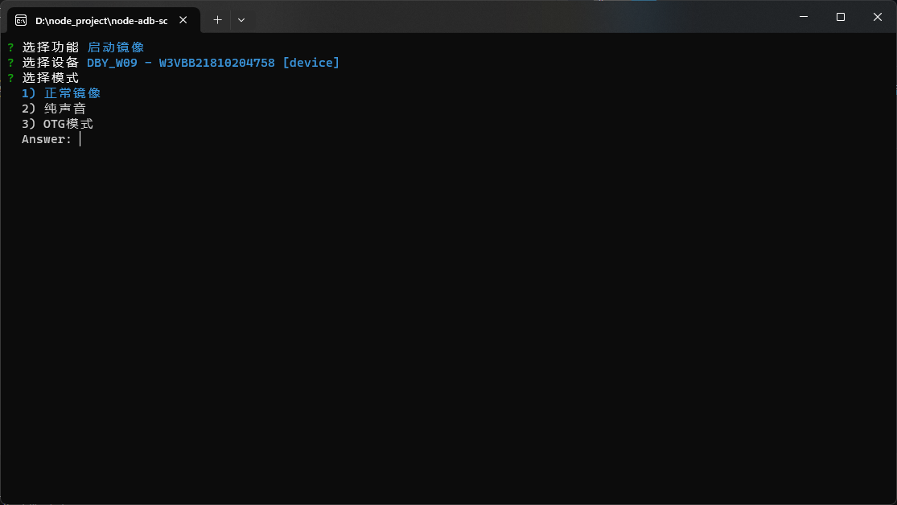
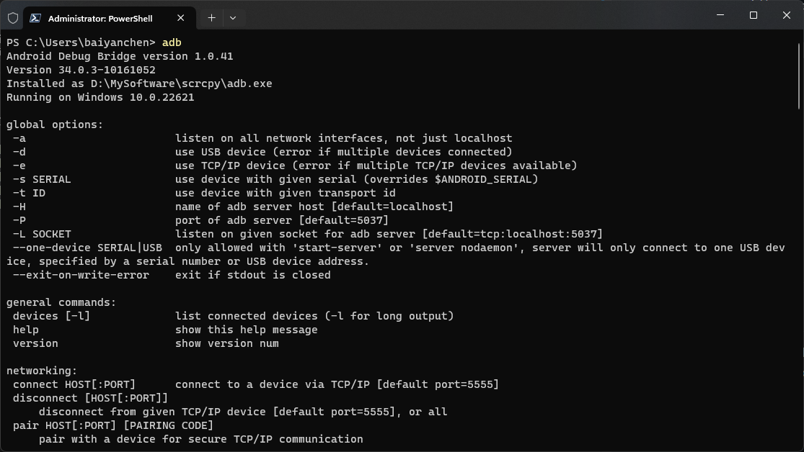
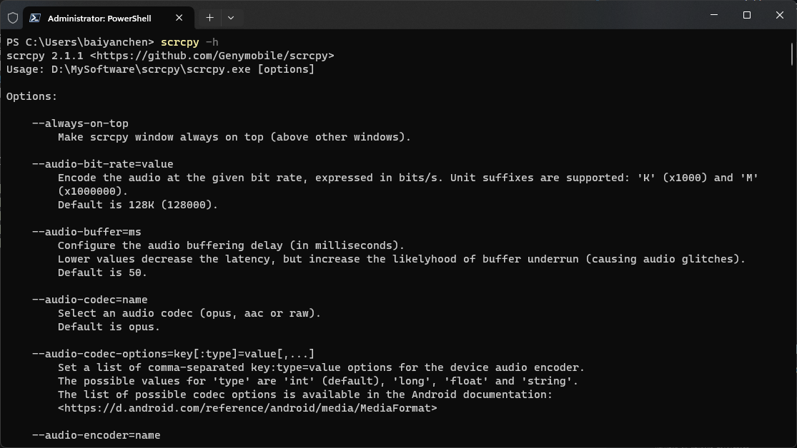

# Node adb scrcpy

Node adb scrcpy 是一个基于 Node.js 的 ADB 命令行工具，可以方便的启动 Scrcpy。



## 先决条件

- 请确保 ADB 和 Scrcpy 是在可用状态
- 可在终端下使用 adb 和 scrcpy -h 命令检查是否可用
- 执行 ``` adb ``` 命令后
  
  
- 执行 ``` scrcpy -h ``` 后

- 

## TODO

现在已经基本能使用了但还想提升一下使用体验

- [x] 自动获取ip
- [x] 支持 OTG
- [x] 支持纯音频
- [ ] 指定配置文件
- [ ] 增加多几个默认的模式
- [ ] 多语言
- [ ] 配置adb和scrcpy的路径
